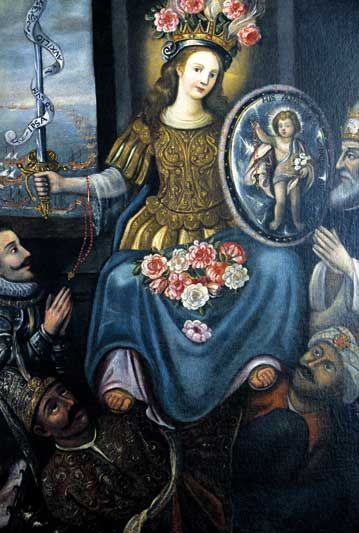

# battleaid

<hr>

## Introduction

Welcome to the official repository and wiki for **battleaid**! This project has two main purposes:

1. Guide users about how to use **battleaid** and it's features, and 
2. Provide a centralized knowledge base for the RoboVikes software team.  

Other teams are invited to learn from, contribute to, or provide feedback to this project.  

<hr>

<div class="sidebar">
   <p></p>
</div>

## Dedication

In October of 1571, Christendom faced destruction at the hands of the invading Ottoman Turks and their undefeated navy.  The only defense for Christendom was 'The Holy League', an improvised fleet from various Catholic countries, paling in size to the Ottoman's.  In desperation, Pope Pius V called on all of Europe to pray the Rosary and ask for the intercession of the Blessed Virgin Mary.  

Against overwhelming odds, the Holy League emerged victorious, shattering the perceived invincibility of the Ottomans.  Pope Pius V, attributing the victory to the Virgin Mary's intercession, instituted the feast day "Our Lady of Victory" in thanksgiving.

**battleaid** is dedicated to Our Lady of Victory.

```
O Victorious Lady! Thou who has ever such powerful influence with thy Divine Son, 
in conquering the hardest of hearts, intercede for those for whom we pray, 
that their hearts being softened by the rays of Divine Grace, they may return to the
unity of the true Faith, through Christ, our Lord. 
Amen.

- Father Baker, circa 1874
```

<hr>

```{toctree}
:maxdepth: 2
:caption: How to use Battleaid
:hidden:

getting-started/quick-start.md
```
